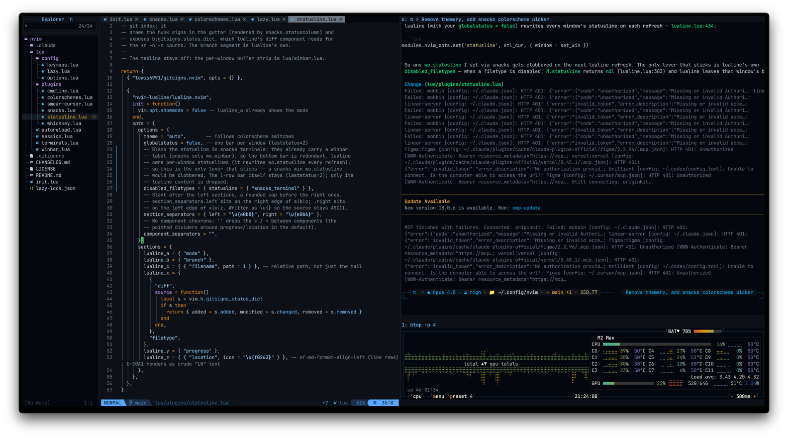

<div align="center">

<pre>
 ▄▄▄▄ ▄▄▄▄  ▄▄▄▄ ▄▄   ▄▄▄▄ ▄▄▄▄▄  ▄▄▄  ▄▄ ▄▄ ▄▄ ▄▄▄▄ ▄▄ 
░█ ░█ ░█ ░█ ░█ ░█ ░█ ░█ ░█ ▀▀ ░█ ░█ ░█ ░█ ░█ ▄▄ ░█ ░█ ░█
▒█ ░█ ▒█ ▀▀ ▒█ ▒█ ▒█ ▒█ ░█ ▄░▀▀  ▒█▀▀▀ ▒█ ░█ ▒█ ▒█ ▒█ ▒█
▓▓ ▓░ ▓▓    ▓▓ ▓▓ ▓▓ ▓▓ ▓░ ▒░ ▒░ ▓▓ ░█ ▓▓ ▓░ ▓▓ ▓▓ ▓▓ ▓▓
 ▀▀▀▀ ▀▀    ▀▀ ▀▀ ▀▀  ▀▀▀▀ ▀▀▀▀▀  ▀▀▀▀  ▀▀▀  ▀▀ ▀▀ ▀▀ ▀▀
</pre>

[](https://neovim.io)
[](LICENSE)
[]()

My Neovim configuration. Lua on [lazy.nvim](https://github.com/folke/lazy.nvim),
built around [snacks.nvim](https://github.com/folke/snacks.nvim), deliberately
no LSP.

It opens instantly and gets out of the way: an explorer sidebar, fuzzy finding
over files, popup completion on the command line, git in the gutter and on the
statusline, sessions that remember your layout per project, and 43 colorschemes
you can flip through with live preview and one keystroke.



</div>

## Requirements

- **Neovim >= 0.12, built with LuaJIT.** `\R` uses the `:restart` built-in,
  which is 0.12+. Check with `:version`. Developed on 0.12.4.
- A **Nerd Font** in your terminal, for the file and statusline icons
- **True colour.** The themes are 24-bit only, so macOS `Terminal.app` will
  render them wrong. iTerm2, Ghostty, WezTerm and Kitty are all fine.
- **[`ripgrep`](https://github.com/BurntSushi/ripgrep)**, for `\ps`. The snacks
  grep picker shells out to `rg`, so live grep does nothing without it.
- **[`lazygit`](https://github.com/jesseduffield/lazygit)**, for `\gg`.
- Optional: [nvim-treesitter](https://github.com/nvim-treesitter/nvim-treesitter)
  with the `regex` and `bash` parsers, which noice uses to highlight the
  cmdline. Everything works without it; `:checkhealth noice` will warn.

## Install

Clone and start Neovim. lazy.nvim bootstraps itself on first run and installs
every plugin -- there is nothing else to set up.

```sh
git clone https://github.com/asifshirazi/nvim.git ~/.config/nvim
nvim
```

## Keymaps

Leader is `\` (Vim's default). Press it and pause to get a
[which-key](https://github.com/folke/which-key.nvim) menu of everything below.

| key | does |
|---|---|
| `<C-t>` | toggle the explorer sidebar |
| `<Tab>` / `<S-Tab>` | next / previous tab in this window's own strip |
| `<C-q>` | close buffer, keeping the window layout |
| `\pf` | find files (dropdown, no preview) |
| `\ps` | live grep, search file contents |
| `\pb` | open buffer list |
| `\pn` | messages log |
| `\gs` | git status (ivy panel) |
| `\gg` | lazygit |
| `\h` | colorscheme picker (snacks), live preview |
| `\d` | development mode: explorer left, file centre, `claude` and `pi` terminals right |
| `\tt` / `\tv` | toggleable shell: split bottom / split right |
| `\tc` / `\tx` | toggleable claude: split bottom / split right |
| `\tp` / `\to` | toggleable omp: split bottom / split right |
| `\l` | reveal whitespace in this window |
| `\R` | `:RestartRestoreSession`, re-execs nvim and restores the whole layout |
| `\bd` | close buffer |

`\d` is the one worth explaining. It lays out a whole working session in a
single keystroke: the explorer on the left revealing the file you were on, that
file in the middle, and two terminals stacked on the right running `claude` and
`pi`. Pair it with `\R`, which re-execs Neovim and puts that layout back
exactly as it was.

In the explorer, files are managed in place: `a` add, `r` rename, `d` delete,
`m` move, `c` copy, `y`/`p` yank and paste, `u` refresh -- each prompting in a
floating input. Dotfiles are visible, and git status is marked per file.

## Colorschemes

The default is `github_dark_tritanopia`, one of
[github-nvim-theme](https://github.com/projekt0n/github-nvim-theme)'s 11 variants
(light, high-contrast and colourblind included). `\h` opens the snacks
colorscheme picker with live preview as you scroll; a committed pick is
remembered by the session (a fresh launch with no session returns to the
default). To change the default permanently, edit the colorscheme name in the
github-nvim-theme spec in `lua/plugins/colorschemes.lua`.

Also installed, all pickable from `\h`:
[gruvbox](https://github.com/ellisonleao/gruvbox.nvim),
[nord](https://github.com/nordtheme/vim),
[vague](https://github.com/vague-theme/vague.nvim),
[modus](https://github.com/miikanissi/modus-themes.nvim) (WCAG AAA),
[tokyonight](https://github.com/folke/tokyonight.nvim).

The statusline follows along automatically: lualine's `auto` theme picks up
whatever colorscheme is active.

## What's in here

| | |
|---|---|
| Explorer & pickers | snacks.nvim (explorer, files, grep, git status) |
| Git | lazygit via snacks, gitsigns hunk signs and counts |
| Statusline | lualine, fed by gitsigns |
| Command line | noice (floating cmdline) + blink.cmp |
| Notifications | snacks notifier, behind noice |
| Sessions | built-in per-directory save/restore (`lua/session.lua`), plus `:RestartRestoreSession` |
| Buffer tabs | winbar strip, drawn per window (in this config) |
| Icons | nvim-web-devicons |
| Cursor | smear-cursor (animated cursor trail) |
| Menus | which-key |

## Layout

```
init.lua          entry point: settings, lazy bootstrap, keymaps, autoreload, session
lua/config/
  options.lua       settings, appearance, providers
  lazy.lua          lazy.nvim bootstrap and setup
  keymaps.lua       mappings (also loads winbar)
lua/plugins/        one spec file per concern
  snacks.lua        explorer, pickers, notifier, terminal, QoL modules
  cmdline.lua       blink.cmp (cmdline only) + noice
  statusline.lua    lualine + gitsigns
  colorschemes.lua  the bundled themes (github_dark_tritanopia default)
  whichkey.lua      the \ menu, hand-ordered
  smear-cursor.lua  animated cursor trail
lua/
  winbar.lua        per-window buffer tabs, and the <Tab> cycling they feed
  session.lua       per-directory session save/restore + :RestartRestoreSession
  autoreload.lua    reload files changed outside nvim, even mid-edit
```

Sessions are saved per working directory, so reopening `nvim` in a project
restores the windows, tabs, explorer and terminals you left behind. Nothing to
name or manage: the layout saves on quit and every minute, and terminal panes
running `claude`, `pi` or `omp` come back with `--continue`, each resuming where
it left off. `:SessionSave` checkpoints on demand and `:SessionDelete` clears
the current directory's session.

Everything is commented with the *reason* for a setting rather than a
restatement of it, usually with a `file:line` pointer into the plugin source
that explains why the line exists at all. If a setting here looks strange, the
comment above it should tell you what went wrong without it.

## Changelog

[CHANGELOG.md](CHANGELOG.md) records what changed in each version. Every
version is tagged and published on the
[releases page](https://github.com/asifshirazi/nvim/releases).

## License

[MIT](LICENSE)
